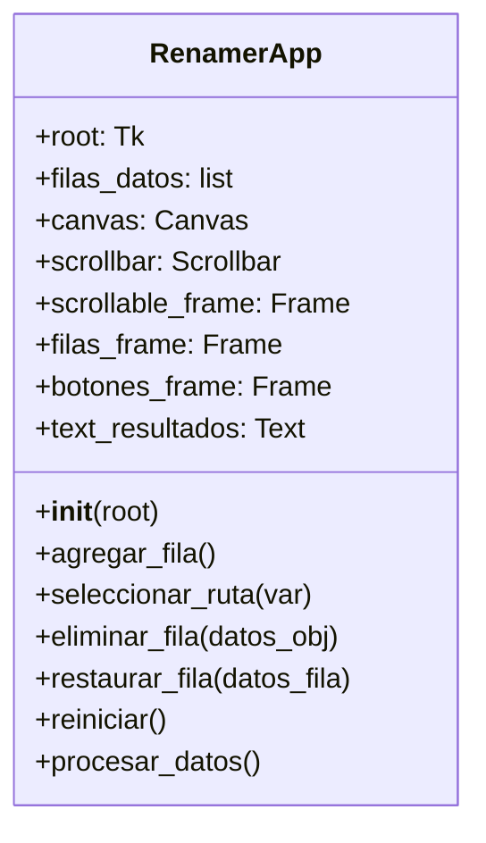

# Manual Técnico - Aplicación de Renombramiento Masivo

Esta aplicación está desarrollada en Python y utiliza Tkinter para la interfaz gráfica de usuario. Permite renombrar archivos de manera masiva en una carpeta seleccionada, con opciones para filtrar por tipo de archivo o procesar todos los archivos. Incluye funcionalidades de restauración y distribución como ejecutable independiente.

La estructura principal se basa en la clase `RenamerApp`, que gestiona la interfaz, validaciones y procesamiento de archivos.

### Componentes Principales

- **Interfaz Gráfica**: Utiliza widgets de Tkinter para crear una interfaz scrollable que permite múltiples configuraciones de renombramiento.
- **Procesamiento de Archivos**: Emplea `pathlib` y `shutil` para manejar rutas y operaciones de archivo de manera segura, soportando renombrado in-situ o copia a destino.
- **Validación**: Incluye validaciones exhaustivas antes del procesamiento para evitar errores, incluyendo verificación de rutas, nombres y tipos.
- **Diccionario de Extensiones**: `EXTENSIONES` define los tipos de archivo soportados, incluyendo una opción "Todos" para procesar cualquier archivo sin filtro de extensión.

### Clase RenamerApp

La clase principal contiene los siguientes atributos y métodos:

#### Atributos

- `root`: Ventana principal de Tkinter.
- `filas_datos`: Lista que almacena los datos de cada fila de configuración.
- `canvas`, `scrollbar`, `scrollable_frame`: Componentes para el área scrollable.
- `filas_frame`: Contenedor para las filas de configuración.
- `botones_frame`: Contenedor para los botones de control.
- `text_resultados`: Widget de texto para mostrar resultados.

#### Métodos

- `__init__(root)`: Inicializa la aplicación y crea la interfaz.
- `agregar_fila()`: Crea una nueva fila de configuración.
- `seleccionar_ruta(var)`: Abre un diálogo de selección de archivo con filtro "Todos los archivos" para elegir un archivo representativo, y establece la carpeta contenedora como la ruta seleccionada.
- `eliminar_fila(datos_obj)`: Elimina una fila de la interfaz y la lista.
- `restaurar_fila(datos_fila)`: Restaura los archivos a su estado original.
- `reiniciar()`: Reinicia la aplicación eliminando todas las filas.
- `procesar_datos()`: Valida y ejecuta el renombramiento de archivos.

### Diagrama de Clases

### Flujo de Procesamiento

1. **Validación**: Se verifican rutas, nombres y tipos para cada fila. Para el tipo "Todos", no se filtra por extensión.
2. **Confirmación**: Se solicita confirmación del usuario antes de proceder.
3. **Procesamiento**: Se itera sobre cada fila, encontrando archivos según el tipo seleccionado (filtrados por extensión o todos los archivos), y renombrándolos o copiándolos al destino especificado.
4. **Registro**: Se actualiza la lista de archivos procesados para permitir restauración a nombres originales.
5. **Resultados**: Se muestran detalles del procesamiento en la interfaz, incluyendo archivos afectados y posibles errores.

### Consideraciones Técnicas

- **Manejo de Errores**: Utiliza bloques try-except para operaciones de archivo, capturando excepciones y mostrando mensajes de error al usuario.
- **Rendimiento**: Los archivos se ordenan alfabéticamente antes del procesamiento para asegurar consistencia en el renombrado secuencial.
- **Seguridad**: Evita sobrescrituras accidentales mediante validaciones previas; utiliza copias cuando se especifica una carpeta destino diferente.
- **Extensibilidad**: El diccionario `EXTENSIONES` facilita la adición de nuevos tipos de archivo. La opción "Todos" permite procesamiento sin restricciones de extensión.
- **Interfaz de Usuario**: Diseño scrollable para manejar múltiples filas de configuración; incluye botones de restauración para revertir cambios.
- **Distribución**: Compatible con creación de ejecutables independientes usando PyInstaller, permitiendo distribución sin instalación de Python.