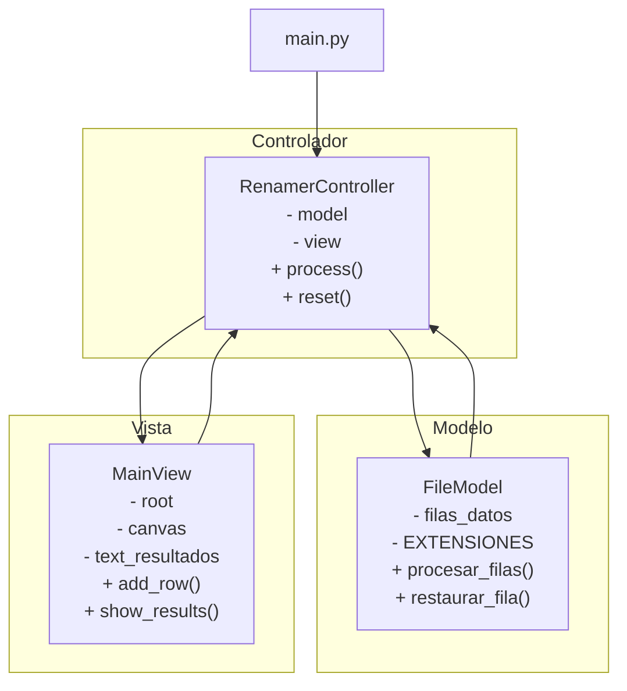
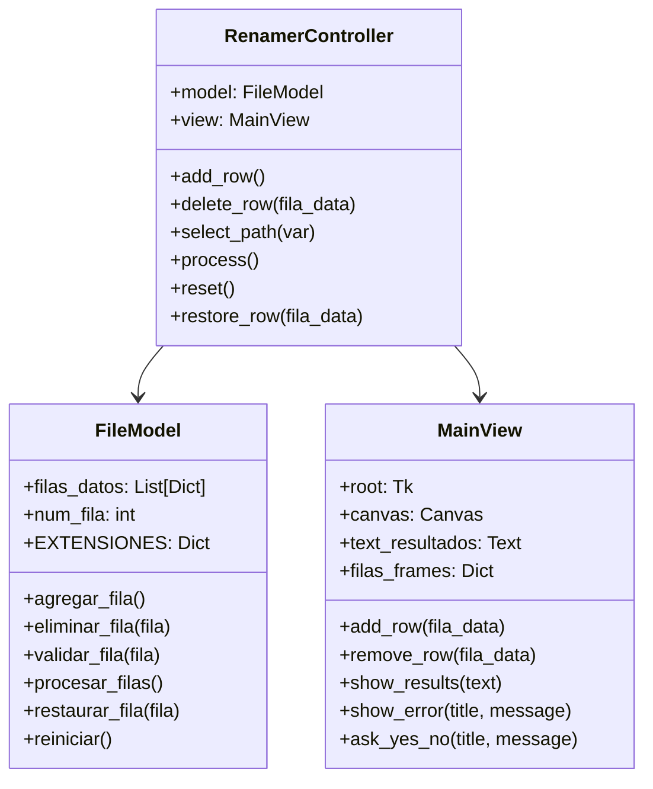

# Manual Técnico - Aplicación de Renombramiento Masivo

Esta aplicación está desarrollada en Python siguiendo el patrón de arquitectura Modelo-Vista-Controlador (MVC) para una mejor separación de responsabilidades, escalabilidad y mantenibilidad. Utiliza Tkinter para la interfaz gráfica de usuario y permite renombrar archivos de manera masiva en una carpeta seleccionada, con opciones para filtrar por tipo de archivo. Incluye funcionalidades de restauración y distribución como ejecutable independiente.

### Arquitectura MVC

La aplicación sigue el patrón Modelo-Vista-Controlador (MVC) para separar responsabilidades:

- **Modelo (`models/file_model.py`)**: Gestiona los datos y la lógica de negocio relacionada con archivos.
- **Vista (`views/main_view.py`)**: Maneja la interfaz de usuario con Tkinter.
- **Controlador (`controllers/renamer_controller.py`)**: Coordina entre modelo y vista, manejando eventos y lógica de aplicación.

### Componentes Principales

- **Interfaz Gráfica**: Utiliza widgets de Tkinter para crear una interfaz scrollable que permite múltiples configuraciones de renombramiento.
- **Procesamiento de Archivos**: Emplea `pathlib` y `shutil` para manejar rutas y operaciones de archivo de manera segura, soportando renombrado in-situ o copia a destino.
- **Validación**: Incluye validaciones exhaustivas antes del procesamiento para evitar errores, incluyendo verificación de rutas, nombres y tipos.
- **Diccionario de Extensiones**: `FileModel.EXTENSIONES` define los tipos de archivo soportados.

### Clases Principales

#### FileModel (Modelo)

Gestiona los datos de filas y operaciones de archivo:

- **Atributos**: `filas_datos`, `num_fila`, `EXTENSIONES`
- **Métodos**: `agregar_fila()`, `eliminar_fila()`, `validar_fila()`, `procesar_filas()`, `restaurar_fila()`, `reiniciar()`

#### MainView (Vista)

Maneja la interfaz de usuario:

- **Atributos**: `root`, `canvas`, `scrollbar`, `text_resultados`, `filas_frames`
- **Métodos**: `add_row()`, `remove_row()`, `show_results()`, `show_error()`, `ask_yes_no()`

#### RenamerController (Controlador)

Coordina modelo y vista:

- **Atributos**: `model`, `view`
- **Métodos**: `add_row()`, `delete_row()`, `select_path()`, `process()`, `reset()`, `restore_row()`

### Diagrama de Arquitectura MVC

### Diagrama de Clases

### Flujo de Procesamiento

1. **Validación**: Se verifican rutas, nombres y tipos para cada fila. Para el tipo "Todos", no se filtra por extensión.
2. **Confirmación**: Se solicita confirmación del usuario antes de proceder.
3. **Procesamiento**: Se itera sobre cada fila, encontrando archivos según el tipo seleccionado (filtrados por extensión o todos los archivos), y renombrándolos o copiándolos al destino especificado.
4. **Registro**: Se actualiza la lista de archivos procesados para permitir restauración a nombres originales.
5. **Resultados**: Se muestran detalles del procesamiento en la interfaz, incluyendo archivos afectados y posibles errores.

### Consideraciones Técnicas

- **Arquitectura MVC**: Separación clara de responsabilidades facilita el mantenimiento, testing y escalabilidad.
- **Manejo de Errores**: Utiliza bloques try-except para operaciones de archivo, capturando excepciones y mostrando mensajes de error al usuario.
- **Rendimiento**: Los archivos se ordenan alfabéticamente antes del procesamiento para asegurar consistencia en el renombrado secuencial.
- **Seguridad**: Evita sobrescrituras accidentales mediante validaciones previas; utiliza copias cuando se especifica una carpeta destino diferente.
- **Extensibilidad**: El diccionario `FileModel.EXTENSIONES` facilita la adición de nuevos tipos de archivo. La arquitectura modular permite agregar nuevas vistas o controladores fácilmente.
- **Interfaz de Usuario**: Diseño scrollable para manejar múltiples filas de configuración; incluye botones de restauración para revertir cambios.
- **Distribución**: Compatible con creación de ejecutables independientes usando PyInstaller, permitiendo distribución sin instalación de Python.
